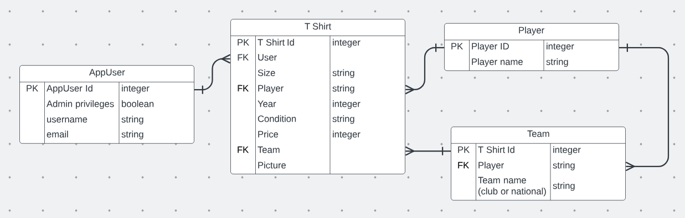

# Offside Outfits Wiki
## TSI Group Project
## Introduction:
### Description

OffsideOutfits is an online retailer for authentic retro football shirts. It offers fully authentic shirts for sale representing a wide range of footballing eras.

With the functionality as it stands, it presents a user with a selection of available T shirts via a get request to our backend. The user can then select one of the T-shirts to add to their cart. This triggers a put request, resulting in association of the user with that T shirt. 

The user can then view their cart, which will have all the T shirts they have added/associated with them.

## Architecture:
### Technology Overview
OffsideOutfits is built using a combination of a Java Springboot back-end and a simple HTML/JS front-end. Unit tests were written using the Java framework Mockito together with JUnit. 

For further organisation/devops, we are using:
- GitHub for source control
- Jira for project management 
- Teams for communication 

### Technical Speccifics
The HTML/JS frontend consumes endpoints configured by the Springboot back-end, which return JSON response, and manipulates them according to the webpage’s needs. There are several endpoints constructed to serve individual purposes, therefore removing the necessity for too much data filtering on the front end.

The backend communicates with a postgresql database, which is deployed on a custom VPS server, located in Germany, which is running Ubuntu.

### Entities
Our entities together with their attributes and relationships are detailed in the ER diagram below:

### Endpoints by resource 
For each resource (Player, T-shirt, Team), we have several endpoints. To list them:

T-shirts:
- @GetMapping("/TShirts") - this endpoint retrieves a list of all T-shirts available. 

- @GetMapping ("/TShirts/{id}") - this endpoint retrieves T-shirts based on a shopper's ID. The {id} in the URL is a path variable that is provided when the request is made. For example, /TShirts/ 1 would fetch T-shirts for the shopper with ID 1.

- @GetMapping ("/TShirtsByUsername") - this endpoint retrieves T-shirts by a shopper's username. The username is passed as a query parameter

- @GetMapping ("/TShirtsByEmail") - same as the previous endpoint, except this one retrieves T-shirts based on the shopper's email.

- @PostMapping("/TShirts") - this endpoint is for adding a new T-shirt.

- @PutMapping("/TShirts/{tShirtId}/{userId}") - allows for updating of a T Shirt entity to link it with a particular user.

AppUser:
- @GetMapping("/appusers"") - gets a list of all the appusers in our database

Player and Team:
Both player and team have two endpoints to serve the following purposes:
- @GetMapping(“/Players OR Teams”) - fetches a list of all items in respective database
- @PostMapping(“/Players OR Teams”) - adds a new item to respective database 

## Examples of classes with clean/refactored code:

### Example 1: 

### Example 2: 

## Doubling

### Testing mock:

### Testing stub:

Mocks and Stubs for Frontend
For the frontend we used HTML,CSS and JavaScript. Due to this we have used a testing framework called Jest which is specifically a Javascript testing framework. The link to the test file:https://github.com/isym444/offsideoutfitsfrontend/pull/2/commits/3e57816689671fca800386db1e67ad3ac0323cf2. In this test file you can see a demonstration of a Mock and a Stub for the frontend components.
Mock Brief Description (frontend)
This test validates that when a T-shirt is already present in the cart array and the addToCart function is invoked with the same T-shirt ID, it correctly prevents the addition of a duplicate. It imitates such a scenario by first placing a mock T-shirt into the cart array. Then, it calls the addToCart function with the same T-shirt ID again. The expectation is that the cart array remains unchanged, ensuring that duplicate items are not added, therefore adhering to the desired behavior of the function.
Stub Brief Description (frontend)
This test proves that when invoking the addToCart method with a specific T-shirt ID, it successfully adds that T-shirt to the cart if it isn't already present. It creates a situation where the tShirts.find method is stubbed to return the selected T-shirt, and the cart.some method is stubbed to return false to indicate that the T-shirt is not already in the cart. We also mock the alert function to mimicking its behavior. After invoking the addToCart function with the T-shirt ID, we check whether the T-shirt is indeed added to the cart array and that the expected alert message is executed.