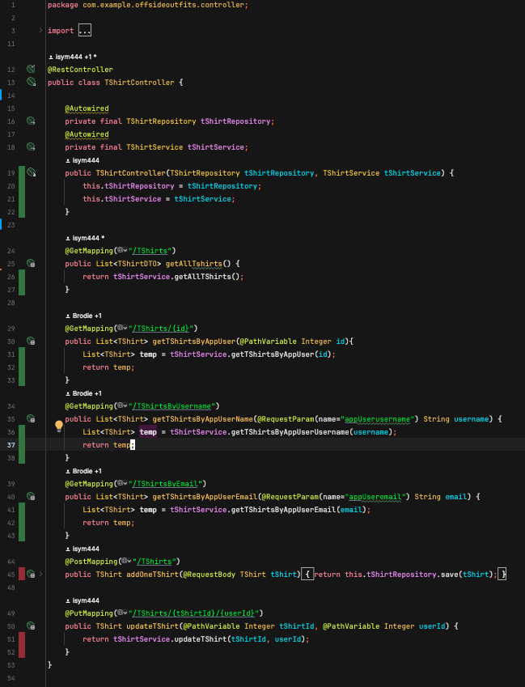

# Offside Outfits Wiki
## TSI Group Project
## Introduction:
### Description

OffsideOutfits is an online retailer for authentic retro football shirts. It offers fully authentic shirts for sale representing a wide range of footballing eras.

With the functionality as it stands, it presents a user with a selection of available T shirts via a get request to our backend. The user can then select one of the T-shirts to add to their cart. This triggers a put request, resulting in association of the user with that T shirt. 

The user can then view their cart, which will have all the T shirts they have added/associated with them.

This corresponds to the data in the database:

N.B. Our frontend code can be found at the following github repository:
https://github.com/isym444/offsideoutfitsfrontend

## Architecture:
### Technology Overview
OffsideOutfits is built using a combination of a Java Springboot back-end and a simple HTML/JS front-end. Unit tests were written using the Java framework Mockito together with JUnit. 

For further organisation/devops, we are using:
- GitHub for source control
- Jira for project management 
- Teams for communication 

### Technical Specifics
The HTML/JS frontend consumes endpoints configured by the Springboot back-end, which return JSON response, and manipulates them according to the webpage’s needs. There are several endpoints constructed to serve individual purposes, therefore removing the necessity for too much data filtering on the front end.

The backend communicates with a postgresql database, which is deployed on a custom VPS server, located in Germany, which is running Ubuntu.

### Entities
Our entities together with their attributes and relationships are detailed in the ER diagram below:

### Endpoints by resource 
For each resource (Player, T-shirt, Team), we have several endpoints. To list them:

T-shirts:
- @GetMapping("/TShirts") - this endpoint retrieves a list of all T-shirts available. 

- @GetMapping ("/TShirts/{id}") - this endpoint retrieves T-shirts based on a shopper's ID. The {id} in the URL is a path variable that is provided when the request is made. For example, /TShirts/ 1 would fetch T-shirts for the shopper with ID 1.

- @GetMapping ("/TShirtsByUsername") - this endpoint retrieves T-shirts by a shopper's username. The username is passed as a query parameter

- @GetMapping ("/TShirtsByEmail") - same as the previous endpoint, except this one retrieves T-shirts based on the shopper's email.

- @PostMapping("/TShirts") - this endpoint is for adding a new T-shirt.

- @PutMapping("/TShirts/{tShirtId}/{userId}") - allows for updating of a T Shirt entity to link it with a particular user.

AppUser:
- @GetMapping("/appusers"") - gets a list of all the appusers in our database

Player and Team:
Both player and team have two endpoints to serve the following purposes:
- @GetMapping(“/Players OR Teams”) - fetches a list of all items in respective database
- @PostMapping(“/Players OR Teams”) - adds a new item to respective database 

## Examples of classes with clean/refactored code:

### Example 1:
src/main/java/com/example/offsideoutfits/controller/TShirtController.java

Screenshot:

### Example 2:
src/main/java/com/example/offsideoutfits/service/impl/TShirtServiceImpl.java

Screenshot:

## Doubling

## Backend:

### Testing mock:
For the backend, our key functionality revolved around the TShirt entity. As such, we have provided a mock and stub to test this. The path to the code for this can be found at: java/com/example/offsideoutfits/TShirtServiceTest.java

We first Mocked the TShirtRepository by using the @Mock mockito annotation. We then provided this to our instance of TShirtServiceImpl by using the @InjectMocks annotation. This ensured that our tShirtService would not actually make a call to our database.

For this short explanation, we would like to bring your attention to testGetTShirtsByAppUser within which we have implemented stubs within the context of our mock:

### Testing stub:
Within testGetTShirtsByAppUser, we create a stub of the findAppByUserId method within the tShirtRepository. We do this by using the Mockito library Mockito.anyInt() method such that no matter what integer is passed into the function as an argument, it returns "expectedTShirts". "expectedTShirts" is in turn a manually declared variable, which is initialized to a list of 2 manually created TShirt() objects.

As such, when the tShirtService.getTshirtsByAppUser(1) method is called, we can then verify (a Junit library method) whether our mocked tShirtRepository findByAppUserAppUserId method is called once as well as asserting whether the return value of our tShirtService method call is the same as our "expectedTShirts".

Image of test method for easy reference:

##  Frontend
For the frontend we used HTML,CSS and JavaScript. Due to this we have used a testing framework called Jest which is specifically a Javascript testing framework. The link to the test: file:https://github.com/isym444/offsideoutfitsfrontend/pull/2/commits/3e57816689671fca800386db1e67ad3ac0323cf2. 

In this test file you can see a demonstration of a Mock and a Stub for the frontend components.
Mock Brief Description (frontend)
This test validates that when a T-shirt is already present in the cart array and the addToCart function is invoked with the same T-shirt ID, it correctly prevents the addition of a duplicate. It imitates such a scenario by first placing a mock T-shirt into the cart array. Then, it calls the addToCart function with the same T-shirt ID again. The expectation is that the cart array remains unchanged, ensuring that duplicate items are not added, therefore adhering to the desired behavior of the function.
Stub Brief Description (frontend)
This test proves that when invoking the addToCart method with a specific T-shirt ID, it successfully adds that T-shirt to the cart if it isn't already present. It creates a situation where the tShirts.find method is stubbed to return the selected T-shirt, and the cart.some method is stubbed to return false to indicate that the T-shirt is not already in the cart. We also mock the alert function to mimicking its behavior. After invoking the addToCart function with the T-shirt ID, we check whether the T-shirt is indeed added to the cart array and that the expected alert message is executed.

## Code Coverage
Please find below our code coverage statistics

# Retrospective - Held on 18/04/2024
## Wind (What is helping us)
- Ian’s new server hosting the database
- Separation of sub tasks and taking responsibility of our own parts
- Jira board assisting with organisation, main tasks split into epics such as front-end implementation and back-end implementation
- Mostly stress-free frontend creation because of Nabeel’s prior experience in the subject matter
- New service and repository layers and general abstraction
- Ian’s discovery of workaround university firewall. When we want to run spring app, it doesn’t let us if we’re on Campus because uni firewall blocks connection to server outside network. Had to connect with mobile hotspot to work on app at uni.

## Anchor (what is holding us back)
- University WiFi firewall blocking access to the server
- AWS server was expensive and slow, therefore switching to VPS server in Germany allowing complete control over database.

- Avoidable merge conflicts caused by changing server and asynchronous communication
- Lack of documentation to help other team members understand and use other peoples parts of the project. Work together as a group physically to share knowledge and understanding of the system as it is developed in real time

## Rocks (foreseeable risks and problems)
- Achieving high test coverage by the deadline

- Working with new technologies that us as developers have no experiences with
- Implementing an effective search bar in the front end could take time to get working, which was part of MVP, therefore too ambitious
- Ian doing too much work and we become over reliant on him. Relates to lack of documentation in anchor section, knowledge should be shared better.
- Time constraints for all developers achieving their targets by the deadline.

## Goal (where we are aiming to be)
- Better integration with each developers section of the project. It should be seamless for one developer to interact with other parts of the code without relying that developer to help/explain what is going on. Perhaps better documentation for how each part of code can be used.
- Stable and easily accessible server/database
- Have each developer create their own tests for their own section, developers can help each other with testing.
- By the end of the project we should feel like each developer has contributed an equal amount of time.
- A good, seamless user experience on the frontend

## Appendix A: How to run the app
In order to run the app, please clone master branches of both backend and frontend (see submission for links to both).

For the backend, please open the repository in intellij. You will then have to set your run configuration environment variables. To see what the configuration should be please see the submission for details (we are not posting it here so we do not expose our credentials to the world).

For the frontend, please open repo in vscode and install the live server extension. Having done so, you can now run the live server for the index.html file on the default port provided by this extension (5500). The frontend will open in a new tab of your default browser. 

At this point, you should now be able to operate the whole app via the frontend.